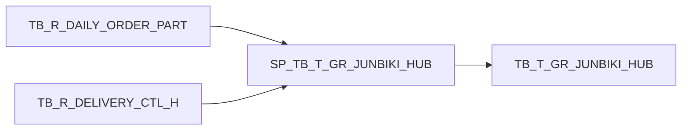

# PRD — SPTrace

## 1. Ringkasan Produk

**SPTrace** adalah offline CLI static analyzer untuk SQL Stored Procedures. Tool ini membaca file `.sql`, mengekstrak metadata dan dependency, mendeteksi pola logic yang berisiko, lalu menghasilkan dokumentasi Markdown, Mermaid dependency diagram, JSON, dan AI-ready context.

**Tagline:**

> Understand legacy Stored Procedures without reading 1,000 lines of SQL.

**Positioning:**

> SPTrace helps backend engineers understand legacy Stored Procedures faster. It scans SQL files, extracts table dependencies, detects risky patterns, and generates Markdown documentation for debugging, onboarding, RCA, and AI-assisted analysis.

## Execution Documents

Dokumen eksekusi untuk implementasi bertahap:

- [`docs/IMPLEMENTATION_SPEC.md`](docs/IMPLEMENTATION_SPEC.md) — detail teknis lengkap agar model murah tidak perlu banyak mengambil keputusan.
- [`docs/TASKS.md`](docs/TASKS.md) — checklist task kecil per phase.
- [`docs/CHEAP_MODEL_PROMPTS.md`](docs/CHEAP_MODEL_PROMPTS.md) — prompt copy/paste untuk menjalankan task satu per satu.

## 2. Problem Statement

Stored Procedure di enterprise sering:

- panjang dan sulit dibaca;
- legacy dan minim dokumentasi;
- menyimpan business logic penting di database;
- sulit ditrace dependency-nya;
- rawan menghasilkan data salah karena join, aggregation, atau duplicate logic;
- sulit dijelaskan ke developer baru, senior, atau atasan saat investigasi issue produksi.

Developer sering perlu menjawab:

- SP ini membaca tabel apa?
- SP ini insert/update/delete ke mana?
- Parameter pentingnya apa?
- Ada temp table apa?
- Ada linked server?
- Ada dynamic SQL?
- Join-nya aman atau berpotensi duplicate?
- Output-nya berdampak ke tabel mana?
- Ada UPDATE/DELETE tanpa WHERE?
- Ada logic yang rawan duplicate amount/qty?

## 3. Product Goals

### 3.1 Tujuan Utama

Membantu engineer memahami Stored Procedure legacy lebih cepat melalui static analysis offline.

### 3.2 Tujuan MVP v0.1

1. Scan single `.sql` file.
2. Extract procedure name.
3. Extract parameters.
4. Extract read/write table dependencies.
5. Extract temp tables.
6. Detect linked server.
7. Detect suspicious/risky logic.
8. Generate Markdown report.
9. Tetap offline, deterministic, dan tanpa database connection.

### 3.3 Non-Goals untuk MVP

MVP **tidak** akan:

- connect ke database;
- mengambil data produksi;
- membutuhkan credential;
- menjalankan query SQL;
- menjamin parsing T-SQL 100% sempurna;
- menggunakan AI sebagai core analyzer;
- membuat desktop app atau web app;
- menggantikan code review/manual verification.

## 4. Target Users

Target awal bukan semua developer, tetapi engineer yang sering berhadapan dengan Stored Procedure legacy.

1. Backend engineer di enterprise.
2. Developer yang maintain legacy MSSQL.
3. Junior developer yang baru masuk project besar.
4. Data engineer yang perlu trace ETL SQL.
5. AI-assisted developer yang perlu membuat context dari Stored Procedure.
6. Engineer yang sering diminta RCA / production issue report.

## 5. Core Value Proposition

SPTrace bukan CRUD project biasa. Produk ini menunjukkan angle:

> Backend engineer yang paham realita enterprise: Stored Procedure, MSSQL, PostgreSQL, data sync, legacy systems, incident debugging, dan AI-assisted workflow.

SPTrace lahir dari problem nyata:

- duplicate material / part number;
- qty dan amount double;
- logic Stored Procedure menyebabkan generated data salah;
- perlu investigasi query/SP legacy;
- perlu report ke atasan dengan evidence.

## 6. Product Form Factor

### 6.1 Bentuk Awal: CLI

Bentuk paling masuk akal untuk v0.1 adalah **CLI offline static analyzer**.

Contoh command:

```bash
sptrace scan SP_TB_T_GR_JUNBIKI_HUB.sql --out report.md
```

Output:

```txt
report.md
dependency.mmd
ai-context.md
```

### 6.2 Alasan CLI Lebih Cocok

1. **Cepat dibuat** — tidak perlu UI, auth, hosting, upload file, database, styling.
2. **Aman untuk konteks enterprise** — tidak berjalan di environment produksi, tidak butuh DB access.
3. **Cocok untuk open-source developer tool** — mudah dipasang lewat package manager.
4. **Mudah diintegrasikan ke AI workflow** — bisa generate `ai-context.md` untuk Claude/ChatGPT/Codex.
5. **Deterministic dan scriptable** — bisa dipakai di CI atau dokumentasi internal.

### 6.3 Product Evolution

1. **Phase 1 — CLI**: core analyzer dan report generator.
2. **Phase 2 — VS Code Extension**: right-click `.sql` → Generate SPTrace Report.
3. **Phase 3 — Web Demo**: paste SQL → generate sample report, untuk marketing/demo.
4. **Phase 4 — Desktop App**: optional, bukan prioritas awal.

## 7. AI Strategy

### 7.1 Core Analyzer Tidak Menggunakan AI

Untuk MVP, SPTrace harus **100% logic-based**:

```txt
.sql file
↓
regex/tokenizer/parser sederhana
↓
extract dependency
↓
detect risk pattern
↓
generate markdown report
```

Core output harus berdasarkan logic yang bisa dijelaskan, bukan AI-generated guesses.

### 7.2 Kenapa Tidak Pakai AI untuk Core MVP

- Mengurangi risiko halusinasi.
- Tidak butuh API key.
- Tidak butuh internet.
- Lebih aman untuk SQL sensitif.
- Lebih mudah dites otomatis.
- Output deterministic.
- Lebih dipercaya untuk corporate/enterprise.

Nilai jual utama:

> No AI required. No database connection. No credentials. Offline SQL analysis.

### 7.3 AI sebagai Optional Add-on

AI dapat menjadi fitur v0.3+ untuk:

- natural language summary;
- RCA draft;
- suggested investigation steps;
- suggested verification queries;
- explanation yang lebih manusiawi.

Contoh command future:

```bash
sptrace explain procedure.sql --ai --provider openai
```

Disclaimer:

> AI explanation is based on static output from SPTrace. Verify before applying changes.

## 8. MVP v0.1 Feature Requirements

## Feature 1 — Extract Stored Procedure Metadata

SPTrace harus mengambil:

- nama procedure;
- parameter;
- variabel penting;
- temp table;
- transaction usage;
- TRY/CATCH usage.

Contoh input:

```sql
CREATE PROCEDURE SP_TB_T_GR_JUNBIKI_HUB
    @PICKUP_DT DATE,
    @ORDER_NO VARCHAR(20)
AS
BEGIN
    SELECT 1
END
```

Contoh output:

```md
## Procedure
- Name: SP_TB_T_GR_JUNBIKI_HUB

## Parameters
| Name | Type |
|---|---|
| @PICKUP_DT | DATE |
| @ORDER_NO | VARCHAR(20) |
```

## Feature 2 — Detect Table Read/Write Dependencies

SPTrace perlu membedakan operasi:

| SQL Pattern | Operation |
|---|---|
| `SELECT FROM` | READ |
| `JOIN` | READ |
| `INSERT INTO` | WRITE |
| `UPDATE` | WRITE |
| `DELETE FROM` | WRITE |
| `MERGE INTO` | READ + WRITE |
| `EXEC procedure` | EXECUTE |

Contoh output:

```md
## Table Dependencies

| Object | Operation | Source |
|---|---|---|
| TB_R_DAILY_ORDER_PART | READ | FROM |
| TB_R_DELIVERY_CTL_H | READ | JOIN |
| TB_T_GR_JUNBIKI_HUB | WRITE | INSERT INTO |
| SP_Dashboard_Preparation | EXECUTE | EXEC |
```

## Feature 3 — Generate Simple Execution Flow

Untuk v0.1, flow boleh rule-based dan tidak harus sempurna.

Contoh:

```md
## Execution Flow

1. Reads manifest data from `TB_R_DAILY_ORDER_MANIFEST`
2. Joins part data from `TB_R_DAILY_ORDER_PART`
3. Aggregates quantity by supplier, order, part number
4. Inserts result into `TB_T_GR_JUNBIKI_HUB`
5. Updates status flag in `TB_R_DAILY_ORDER_MANIFEST`
```

## Feature 4 — Detect Suspicious Logic

Inilah fitur pembeda utama SPTrace. Rule awal:

### Duplicate Aggregation Risk

Deteksi:

- ada `SUM()` atau `COUNT()`;
- ada `JOIN` satu atau lebih;
- ada `GROUP BY`;
- terutama jika ada `INSERT INTO ... SELECT`.

Output:

```md
### High: Possible duplicate aggregation

This procedure aggregates data after joining multiple tables. If the join keys are not unique, quantity or amount may be duplicated.

Suggested checks:
- Check duplicate key combinations in source detail table
- Pre-aggregate detail rows before joining master table
- Verify whether additional join keys are required
```

### Missing WHERE on UPDATE/DELETE

Deteksi:

```sql
UPDATE TB_R_MANIFEST
SET STATUS = '1'
```

Output:

```md
- UPDATE statement may be missing WHERE condition.
```

### SELECT Star

Deteksi:

```sql
SELECT * FROM TB_R_DAILY_ORDER_PART
```

Output:

```md
- SELECT * found. This may make the procedure fragile when table schema changes.
```

### Dynamic SQL

Deteksi:

```sql
EXEC(@SQL)
EXEC sp_executesql @SQL
```

Output:

```md
- Dynamic SQL found. Static dependency detection may be incomplete.
```

### Linked Server

Deteksi object 4-part:

```sql
IPPCS_PROD.DB_NAME.dbo.TB_R_DAILY_ORDER_MANIFEST
```

Output:

```md
- Linked server usage found. External DB dependency should be verified.
```

### NOLOCK

Deteksi:

```sql
WITH (NOLOCK)
```

Output:

```md
- NOLOCK found. Query may read dirty/uncommitted data.
```

## Feature 5 — Generate Markdown Report

Command:

```bash
sptrace scan SP_TB_T_GR_JUNBIKI_HUB.sql --out report.md
```

Output folder default:

```txt
sptrace-output/
  report.md
  dependency.mmd
  ai-context.md
```

## Feature 6 — Mermaid Dependency Diagram

Command:

```bash
sptrace scan procedure.sql --diagram mermaid
```

Output:

```md
## Dependency Diagram


```

## 9. CLI Design

### 9.1 Basic Scan

```bash
sptrace scan procedure.sql
```

### 9.2 Output to Markdown

```bash
sptrace scan procedure.sql --out report.md
```

### 9.3 Output JSON

```bash
sptrace scan procedure.sql --json
```

Contoh JSON:

```json
{
  "procedure": "SP_TB_T_GR_JUNBIKI_HUB",
  "parameters": [
    { "name": "@PICKUP_DT", "type": "DATE" },
    { "name": "@ORDER_NO", "type": "VARCHAR(20)" }
  ],
  "dependencies": {
    "reads": ["TB_R_DAILY_ORDER_PART", "TB_R_DELIVERY_CTL_H"],
    "writes": ["TB_T_GR_JUNBIKI_HUB"],
    "executes": []
  },
  "risks": [
    {
      "type": "duplicate_aggregation",
      "severity": "high",
      "message": "SUM() after multi-table JOIN may duplicate quantity or amount."
    }
  ]
}
```

### 9.4 Analyze Folder

```bash
sptrace scan ./stored-procedures --out docs/
```

Generated files:

```txt
docs/
  SP_TB_T_GR_JUNBIKI_HUB.md
  SP_RSC1_003_UpdateDcl.md
  dependency-index.md
```

### 9.5 Generate AI Context

```bash
sptrace context procedure.sql --out ai-context.md
```

Output:

```md
# AI Context for Stored Procedure Analysis

## Procedure
SP_TB_T_GR_JUNBIKI_HUB

## Problem
This procedure may generate duplicate quantity/amount.

## Extracted Dependencies
...

## Suspicious Logic
...

## Ask
Analyze this procedure and suggest possible causes of duplicate generated records.
```

### 9.6 Future Diff Mode

```bash
sptrace diff before.sql after.sql
```

Output:

```md
## Procedure Diff

### New Tables Read
- TB_R_DELIVERY_CTL_ROUTE

### Changed Write Target
- TB_T_GR_JUNBIKI_HUB

### Risk Change
- Duplicate aggregation risk: High → Low
```

## 10. Report Structure

Ideal final report:

```md
# SPTrace Report: SP_TB_T_GR_JUNBIKI_HUB

## 1. Overview
- Procedure: SP_TB_T_GR_JUNBIKI_HUB
- Dialect: T-SQL
- Statements: 18
- Risk Level: High

## 2. Parameters
| Parameter | Type | Nullable/Default |
|---|---|---|
| @PICKUP_DT | DATE | Required |
| @ORDER_NO | VARCHAR(20) | Required |

## 3. Dependencies

### Tables Read
- TB_R_DAILY_ORDER_MANIFEST
- TB_R_DAILY_ORDER_PART
- TB_R_DELIVERY_CTL_H

### Tables Written
- TB_T_GR_JUNBIKI_HUB

### Procedures Executed
- None detected

### External Dependencies
- IPPCS_PROD linked server

## 4. Execution Flow
1. Load manifest records by pickup date
2. Join order part with delivery control
3. Aggregate quantity and amount
4. Insert generated result into GR hub table

## 5. Risk Findings

### High: Possible duplicate aggregation
`SUM()` is used after joining multiple tables. If the join condition is not unique, quantity or amount can be multiplied.

Suggested checks:
- Validate uniqueness of PART_NO per ORDER_NO
- Validate whether MANIFEST_NO should be part of join key
- Pre-aggregate detail rows before joining master data

### Medium: Linked server dependency
The procedure references external server `IPPCS_PROD`.

Suggested checks:
- Verify linked server availability
- Verify source and target data freshness

## 6. Questions to Verify
- Is PART_NO unique per PO?
- Is MANIFEST_NO required for join uniqueness?
- Should amount be calculated after grouping or before grouping?

## 7. Suggested Next Query
```sql
SELECT ORDER_NO, PART_NO, COUNT(*) AS CNT
FROM TB_R_DAILY_ORDER_PART
GROUP BY ORDER_NO, PART_NO
HAVING COUNT(*) > 1;
```
```

## 11. Risk Rules

| Rule ID | Severity | Detection |
|---|---:|---|
| `select_star` | Low | Ada `SELECT *` |
| `nolock_used` | Medium | Ada `WITH (NOLOCK)` |
| `dynamic_sql` | Medium | Ada `EXEC(@sql)` / `sp_executesql` |
| `linked_server` | Medium | Object name 4-part seperti `SERVER.DB.SCHEMA.TABLE` |
| `update_without_where` | High | `UPDATE table SET` tanpa `WHERE` |
| `delete_without_where` | High | `DELETE FROM table` tanpa `WHERE` |
| `insert_select_no_distinct` | Medium | `INSERT INTO ... SELECT` tanpa dedupe indicator |
| `multi_join_aggregation` | High | `SUM/COUNT` + `JOIN` + `GROUP BY` |
| `temp_table_chain` | Low | Banyak temp table, flow kompleks |
| `cursor_used` | Medium | Ada `CURSOR` |
| `transaction_without_trycatch` | Medium | Ada `BEGIN TRAN` tanpa `TRY/CATCH` |
| `trycatch_without_rollback` | High | Ada `TRY/CATCH` tapi tidak ada `ROLLBACK` |
| `hardcoded_date` | Low | Ada literal tanggal seperti `'2026-06-02'` |
| `status_magic_number` | Low | Status angka langsung seperti `STATUS = 2` |
| `nested_exec_dependency` | Medium | SP memanggil SP lain via `EXEC` |
| `merge_used` | Medium | Ada `MERGE`, perlu validasi race condition/duplicate match |
| `cross_database_reference` | Medium | Object 3-part seperti `DB.SCHEMA.TABLE` |
| `missing_transaction_for_multi_write` | Medium | Banyak write operation tanpa explicit transaction |

## 12. Parsing Strategy

T-SQL sulit karena mendukung:

- temp table;
- table variable;
- dynamic SQL;
- linked server;
- bracket identifier `[dbo].[Table]`;
- nested stored procedure;
- CTE;
- MERGE;
- IF/ELSE;
- TRY/CATCH;
- comments;
- semicolon optional;
- schema/database/server qualification.

Strategi:

- **v0.1:** regex/token-based analyzer.
- **v0.2:** partial AST parser.
- **v0.3:** dialect-specific analysis.

## 13. Recommended Tech Stack

Karena project lain sudah memakai Rust, SPTrace disarankan memakai Rust.

| Library | Use |
|---|---|
| `clap` | CLI argument parsing |
| `regex` | Extraction awal |
| `serde` | Serialization model |
| `serde_json` | JSON output |
| `walkdir` | Folder scan |
| `tera` | Markdown template rendering |
| `anyhow` | Error handling |
| `colored` | Terminal output |

## 14. Proposed Repository Structure

```txt
sptrace/
  src/
    main.rs
    cli.rs
    parser.rs
    analyzer.rs
    rules.rs
    report.rs
    model.rs
  templates/
    report.md.tera
    ai-context.md.tera
  examples/
    procedures/
      duplicate_aggregation.sql
      linked_server.sql
      update_without_where.sql
    expected/
      duplicate_aggregation.md
  tests/
    fixtures/
      sample_basic.sql
      sample_duplicate_aggregation.sql
      sample_dynamic_sql.sql
  README.md
  PRD.md
```

## 15. Internal Data Model

```rust
#[derive(Debug, Serialize)]
pub struct ProcedureTrace {
    pub name: Option<String>,
    pub parameters: Vec<Parameter>,
    pub dependencies: Vec<Dependency>,
    pub temp_tables: Vec<String>,
    pub risks: Vec<RiskFinding>,
    pub statements: Vec<StatementSummary>,
}

#[derive(Debug, Serialize)]
pub struct Parameter {
    pub name: String,
    pub data_type: String,
}

#[derive(Debug, Serialize)]
pub struct Dependency {
    pub object: String,
    pub operation: Operation,
    pub source: String,
}

#[derive(Debug, Serialize)]
pub enum Operation {
    Read,
    Write,
    Execute,
    Unknown,
}

#[derive(Debug, Serialize)]
pub struct RiskFinding {
    pub rule_id: String,
    pub severity: Severity,
    pub message: String,
    pub suggestion: String,
}
```

Tambahan model yang disarankan:

```rust
#[derive(Debug, Serialize)]
pub struct StatementSummary {
    pub index: usize,
    pub kind: StatementKind,
    pub target: Option<String>,
    pub sources: Vec<String>,
    pub line_start: Option<usize>,
    pub line_end: Option<usize>,
}

#[derive(Debug, Serialize)]
pub enum StatementKind {
    Select,
    Insert,
    Update,
    Delete,
    Merge,
    Execute,
    Transaction,
    Unknown,
}

#[derive(Debug, Serialize)]
pub enum Severity {
    Low,
    Medium,
    High,
}
```

## 16. Initial Regex Rules

### 16.1 Detect Table Read

```regex
(?i)\bFROM\s+([a-zA-Z0-9_\[\]\.]+)
(?i)\bJOIN\s+([a-zA-Z0-9_\[\]\.]+)
```

### 16.2 Detect Table Write

```regex
(?i)\bINSERT\s+INTO\s+([a-zA-Z0-9_\[\]\.]+)
(?i)\bUPDATE\s+([a-zA-Z0-9_\[\]\.]+)
(?i)\bDELETE\s+FROM\s+([a-zA-Z0-9_\[\]\.]+)
(?i)\bMERGE\s+INTO\s+([a-zA-Z0-9_\[\]\.]+)
```

### 16.3 Detect Duplicate Aggregation Risk

Pseudo logic:

```rust
let has_aggregation = sql.contains("SUM(") || sql.contains("COUNT(");
let join_count = count_keyword(sql, "JOIN");
let has_group_by = sql.contains("GROUP BY");

if has_aggregation && join_count >= 1 && has_group_by {
    add_risk("multi_join_aggregation", Severity::High);
}
```

## 17. Example Demo for GitHub

Jangan gunakan Stored Procedure kantor asli. Gunakan dummy sample.

Input:

```sql
CREATE PROCEDURE SP_GENERATE_GR_SAMPLE
    @ORDER_NO VARCHAR(20)
AS
BEGIN
    INSERT INTO TB_T_GR_HUB
    SELECT
        h.ORDER_NO,
        d.PART_NO,
        SUM(d.QTY) AS TOTAL_QTY,
        SUM(d.AMOUNT) AS TOTAL_AMOUNT
    FROM TB_R_DAILY_ORDER_PART d
    JOIN TB_R_DELIVERY_CTL_H h
        ON d.ORDER_NO = h.ORDER_NO
    JOIN TB_R_DELIVERY_CTL_D x
        ON h.DELIVERY_NO = x.DELIVERY_NO
    WHERE h.ORDER_NO = @ORDER_NO
    GROUP BY h.ORDER_NO, d.PART_NO
END
```

Output:

```md
# SPTrace Report: SP_GENERATE_GR_SAMPLE

## Tables Read
- TB_R_DAILY_ORDER_PART
- TB_R_DELIVERY_CTL_H
- TB_R_DELIVERY_CTL_D

## Tables Written
- TB_T_GR_HUB

## Risk Findings

### High: Possible duplicate aggregation
This procedure aggregates `QTY` and `AMOUNT` after joining multiple tables. If the join keys are not unique, totals may be multiplied.

Suggested verification query:

```sql
SELECT ORDER_NO, PART_NO, COUNT(*) AS CNT
FROM TB_R_DAILY_ORDER_PART
GROUP BY ORDER_NO, PART_NO
HAVING COUNT(*) > 1;
```
```

## 18. Acceptance Criteria for v0.1

### CLI

- `sptrace scan file.sql` runs successfully for a valid `.sql` file.
- `sptrace scan file.sql --out report.md` writes a Markdown report.
- Invalid file path returns clear error message.
- Empty file returns clear warning/error.

### Metadata Extraction

- Procedure name is detected from `CREATE PROCEDURE` or `ALTER PROCEDURE`.
- Parameters are extracted with name and data type.
- Temp tables are detected from `#table` references.

### Dependency Extraction

- Tables from `FROM` and `JOIN` are marked as READ.
- Tables from `INSERT INTO`, `UPDATE`, `DELETE FROM`, `MERGE INTO` are marked as WRITE.
- Procedures from `EXEC` are marked as EXECUTE where possible.
- Duplicate dependencies are deduplicated in report.

### Risk Detection

- `SELECT *` produces `select_star` risk.
- `WITH (NOLOCK)` produces `nolock_used` risk.
- `EXEC(@sql)` or `sp_executesql` produces `dynamic_sql` risk.
- 4-part object name produces `linked_server` risk.
- `UPDATE ... SET ...` without `WHERE` produces `update_without_where` risk.
- `DELETE FROM ...` without `WHERE` produces `delete_without_where` risk.
- `SUM/COUNT + JOIN + GROUP BY` produces `multi_join_aggregation` risk.

### Report

- Report contains Overview, Parameters, Dependencies, Temp Tables, Execution Flow, Risk Findings, Questions to Verify, and Suggested Next Queries.
- Report can be committed to GitHub as readable documentation.

## 19. Success Metrics

### Developer/Product Metrics

- A user can understand the main dependencies of a 500+ line SP in under 2 minutes.
- Report generation for a single SP finishes in under 1 second for typical files.
- v0.1 supports at least 10 example SQL fixtures.
- At least 8 risk rules implemented.
- README demo is understandable without installing a database.

### Open Source Metrics

- Clear README with before/after demo.
- Installation instructions available.
- Example SQL files included.
- First GitHub release tagged `v0.1.0`.
- Issues labeled for `parser`, `rules`, `report`, `docs`, and `good first issue`.

## 20. Roadmap

### v0.1 — Basic X-Ray

- Scan single `.sql` file.
- Extract proc name.
- Extract parameters.
- Extract read/write tables.
- Detect temp tables.
- Detect linked server.
- Detect suspicious rules.
- Output Markdown.

### v0.2 — Folder Scan + Mermaid + JSON

- Scan folder of Stored Procedures.
- Generate one report per SP.
- Generate dependency index.
- Generate Mermaid graph.
- Output JSON.

### v0.3 — AI Context Mode

- Generate `ai-context.md`.
- Generate debugging questions.
- Generate suggested verification queries.
- Optional AI explanation via provider config.

### v0.4 — Diff Mode

Command:

```bash
sptrace diff before.sql after.sql
```

Features:

- new/removed tables read;
- changed write target;
- added/removed risks;
- risk level change.

### v0.5 — Rule Config

Example config:

```yaml
rules:
  required_join_keys:
    - ORDER_NO
    - PART_NO
    - MANIFEST_NO

  risky_tables:
    - TB_T_GR_JUNBIKI_HUB
    - TB_R_DAILY_ORDER_MANIFEST
```

## 21. Security and Privacy Requirements

SPTrace must be safe by default:

- no database connection;
- no credential handling;
- no telemetry by default;
- no source upload;
- no AI call unless explicitly requested;
- local file input only;
- clear warning for AI features if added later.

Marketing copy:

> No database connection. No credentials. No production access. Offline static analysis only.

## 22. README Positioning Draft

```md
# SPTrace

Understand legacy Stored Procedures without reading 1,000 lines of SQL.

SPTrace is an offline static analyzer for SQL Stored Procedures. It extracts table dependencies, execution flow, temp tables, linked servers, and risky logic patterns, then generates a readable Markdown report.

No database connection. No credentials. No production access.

## Why?

In many enterprise systems, business logic lives inside Stored Procedures. Documentation is often missing, and debugging production issues means reading long SQL scripts manually.

SPTrace helps engineers quickly answer:

- What tables does this procedure read?
- What tables does it write?
- Does it use temp tables or linked servers?
- Is there risky aggregation logic?
- Are there UPDATE/DELETE statements without WHERE?
- What questions should I verify before changing this procedure?
```

## 23. Smallest Build Plan for This Week

Build the smallest useful version first:

```bash
sptrace scan file.sql
```

Terminal output:

```txt
Procedure: SP_GENERATE_GR_SAMPLE

Reads:
- TB_R_DAILY_ORDER_PART
- TB_R_DELIVERY_CTL_H
- TB_R_DELIVERY_CTL_D

Writes:
- TB_T_GR_HUB

Risks:
[HIGH] multi_join_aggregation - SUM used after JOIN and GROUP BY.
[LOW] select_star - SELECT * found.
```

Then add:

```bash
sptrace scan file.sql --out report.md
```

Do not build a perfect parser first. Ship a useful X-ray tool first.

## 24. Open Questions

1. Should v0.1 focus only on T-SQL/MSSQL, or also support PostgreSQL PL/pgSQL syntax labels?
2. Should report output default to `sptrace-output/report.md` or stdout?
3. Should Mermaid diagram be generated by default or behind `--diagram mermaid`?
4. Should `UPDATE`/`DELETE` without `WHERE` detection handle statement boundaries via semicolon, `GO`, or keyword scanning?
5. Should rule severity be hardcoded in v0.1 or configurable from the beginning?
6. Should the crate/package name be `sptrace` if already taken on registries?

## 25. Final Recommendation

Build SPTrace as:

> Offline Stored Procedure analyzer for legacy SQL systems.

Start with:

1. CLI only.
2. Logic-based analyzer only.
3. Markdown report first.
4. No DB connection.
5. No AI dependency.
6. Add AI context later as optional helper.

This is small enough to build quickly, but strong enough to look different and useful on GitHub.
