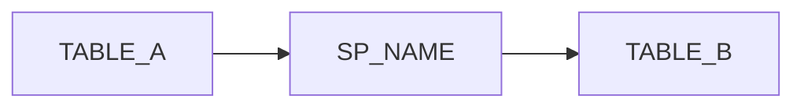
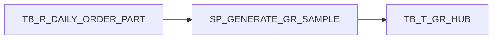

# SPTrace MVP v0.1 — Implementation Specification

Dokumen ini dibuat supaya implementasi bisa dieksekusi oleh model murah secara bertahap, tanpa perlu banyak keputusan desain.

## 0. Prinsip Eksekusi untuk Model Murah

Model murah sebaiknya tidak diminta “bangun semua SPTrace”. Pecah menjadi task kecil yang deterministic.

Aturan kerja:

1. Jangan ubah scope tanpa instruksi.
2. Jangan tambah AI/API/database connection.
3. Jangan pakai parser SQL kompleks dulu.
4. Jangan optimasi prematur.
5. Kerjakan satu task kecil per prompt.
6. Setelah tiap task, jalankan test/command.
7. Jika ada ambiguity, pilih solusi paling sederhana yang sesuai spec ini.
8. Semua output harus deterministic.
9. Semua risk rule harus berdasarkan pattern yang jelas.
10. Jangan memakai SQL kantor asli untuk test/demo.

## 1. Target Output v0.1

Command minimum:

```bash
sptrace scan examples/procedures/duplicate_aggregation.sql
```

Output terminal minimum:

```txt
Procedure: SP_GENERATE_GR_SAMPLE

Parameters:
- @ORDER_NO VARCHAR(20)

Tables Read:
- TB_R_DAILY_ORDER_PART
- TB_R_DELIVERY_CTL_H
- TB_R_DELIVERY_CTL_D

Tables Written:
- TB_T_GR_HUB

Temp Tables:
- None

Risks:
[HIGH] multi_join_aggregation - SUM/COUNT used with JOIN and GROUP BY. Aggregated values may be duplicated if join keys are not unique.
```

Command Markdown:

```bash
sptrace scan examples/procedures/duplicate_aggregation.sql --out sptrace-output/report.md
```

Expected files:

```txt
sptrace-output/report.md
```

Optional v0.1 command:

```bash
sptrace scan examples/procedures/duplicate_aggregation.sql --json
```

## 2. Tech Stack Locked

Use Rust.

Required crates:

```toml
[dependencies]
anyhow = "1"
clap = { version = "4", features = ["derive"] }
colored = "2"
regex = "1"
serde = { version = "1", features = ["derive"] }
serde_json = "1"
walkdir = "2"
```

Do not add `tera` in the first implementation unless Markdown template rendering is already needed. For MVP v0.1, string builder is enough.

## 3. Repository Structure to Create

```txt
sptrace/
  Cargo.toml
  README.md
  PRD.md
  docs/
    IMPLEMENTATION_SPEC.md
    TASKS.md
    CHEAP_MODEL_PROMPTS.md
  src/
    main.rs
    cli.rs
    model.rs
    normalizer.rs
    parser.rs
    analyzer.rs
    rules.rs
    report.rs
  examples/
    procedures/
      duplicate_aggregation.sql
      linked_server.sql
      update_without_where.sql
      dynamic_sql.sql
      select_star_nolock.sql
  tests/
    fixtures/
      basic_proc.sql
```

## 4. Module Responsibilities

### 4.1 `src/main.rs`

Responsibilities:

- call CLI parser;
- dispatch command;
- read input file;
- call analyzer;
- output terminal/JSON/Markdown.

Do not put parsing/rule logic in `main.rs`.

### 4.2 `src/cli.rs`

Defines CLI structs with `clap`.

Target interface:

```bash
sptrace scan <path> [--out <file>] [--json]
```

Rust shape:

```rust
use clap::{Parser, Subcommand};
use std::path::PathBuf;

#[derive(Debug, Parser)]
#[command(name = "sptrace")]
#[command(about = "Offline Stored Procedure analyzer for legacy SQL systems")]
pub struct Cli {
    #[command(subcommand)]
    pub command: Commands,
}

#[derive(Debug, Subcommand)]
pub enum Commands {
    Scan {
        path: PathBuf,
        #[arg(long)]
        out: Option<PathBuf>,
        #[arg(long)]
        json: bool,
    },
}
```

### 4.3 `src/model.rs`

Only data structures.

Required structs/enums:

```rust
use serde::Serialize;

#[derive(Debug, Serialize, Clone)]
pub struct ProcedureTrace {
    pub name: Option<String>,
    pub parameters: Vec<Parameter>,
    pub dependencies: Vec<Dependency>,
    pub temp_tables: Vec<String>,
    pub risks: Vec<RiskFinding>,
    pub statements: Vec<StatementSummary>,
    pub metrics: TraceMetrics,
}

#[derive(Debug, Serialize, Clone)]
pub struct TraceMetrics {
    pub statement_count: usize,
    pub read_count: usize,
    pub write_count: usize,
    pub risk_level: Severity,
}

#[derive(Debug, Serialize, Clone)]
pub struct Parameter {
    pub name: String,
    pub data_type: String,
    pub default_value: Option<String>,
}

#[derive(Debug, Serialize, Clone, PartialEq, Eq, Hash)]
pub struct Dependency {
    pub object: String,
    pub operation: Operation,
    pub source: String,
}

#[derive(Debug, Serialize, Clone, PartialEq, Eq, Hash)]
pub enum Operation {
    Read,
    Write,
    Execute,
    Unknown,
}

#[derive(Debug, Serialize, Clone)]
pub struct RiskFinding {
    pub rule_id: String,
    pub severity: Severity,
    pub message: String,
    pub suggestion: String,
}

#[derive(Debug, Serialize, Clone, PartialEq, Eq, PartialOrd, Ord)]
pub enum Severity {
    Low,
    Medium,
    High,
}

#[derive(Debug, Serialize, Clone)]
pub struct StatementSummary {
    pub index: usize,
    pub kind: StatementKind,
    pub target: Option<String>,
    pub sources: Vec<String>,
}

#[derive(Debug, Serialize, Clone)]
pub enum StatementKind {
    Select,
    Insert,
    Update,
    Delete,
    Merge,
    Execute,
    Transaction,
    Unknown,
}
```

Implementation detail:

- derive `Serialize` for JSON output;
- derive `Clone` where useful;
- `Operation` must derive `Hash` so dependencies can be deduped.

### 4.4 `src/normalizer.rs`

Responsibilities:

- remove SQL comments;
- normalize whitespace;
- normalize object identifiers;
- split SQL into statements approximately.

Functions:

```rust
pub fn strip_comments(sql: &str) -> String;
pub fn normalize_whitespace(sql: &str) -> String;
pub fn normalize_identifier(identifier: &str) -> String;
pub fn split_statements(sql: &str) -> Vec<String>;
```

Rules:

- remove line comments starting with `--`;
- remove block comments `/* ... */` using regex with dot-all;
- keep string literals unchanged as much as possible;
- replace repeated whitespace with one space in `normalize_whitespace`;
- trim trailing `;` and `,` from identifiers;
- remove brackets from identifiers: `[dbo].[Table]` → `dbo.Table`;
- do not lowercase object names in output; preserve detected case if possible.

Known limitation:

- comment stripping may accidentally remove markers inside string literals. Acceptable for v0.1.

### 4.5 `src/parser.rs`

Responsibilities:

- extract procedure name;
- extract parameters;
- extract table dependencies;
- extract temp table names;
- extract rough statement summaries.

Functions:

```rust
use crate::model::*;

pub fn extract_procedure_name(sql: &str) -> Option<String>;
pub fn extract_parameters(sql: &str) -> Vec<Parameter>;
pub fn extract_dependencies(sql: &str) -> Vec<Dependency>;
pub fn extract_temp_tables(sql: &str) -> Vec<String>;
pub fn summarize_statements(sql: &str) -> Vec<StatementSummary>;
```

#### Procedure name detection

Regex:

```regex
(?i)\b(?:CREATE|ALTER)\s+(?:OR\s+ALTER\s+)?PROCEDURE\s+([a-zA-Z0-9_\[\]\.]+)
```

Also support:

```regex
(?i)\bCREATE\s+PROC\s+([a-zA-Z0-9_\[\]\.]+)
(?i)\bALTER\s+PROC\s+([a-zA-Z0-9_\[\]\.]+)
```

Normalize identifier before returning.

#### Parameter extraction

Parameter section is between procedure name and `AS` keyword.

Supported examples:

```sql
CREATE PROCEDURE dbo.SP_TEST
    @ORDER_NO VARCHAR(20),
    @PICKUP_DT DATE = NULL,
    @FLAG INT = 0
AS
BEGIN
END
```

Regex per parameter:

```regex
(?i)(@[a-zA-Z0-9_]+)\s+([a-zA-Z0-9_]+(?:\s*\([^\)]*\))?)(?:\s*=\s*([^,\n]+))?
```

Expected:

- `@ORDER_NO` → `VARCHAR(20)` default None;
- `@PICKUP_DT` → `DATE` default `NULL`;
- `@FLAG` → `INT` default `0`.

Limitations acceptable:

- table-valued parameters are not fully supported;
- output parameters may be parsed as part of type if present;
- complex default expressions may be imperfect.

#### Dependency extraction

Read regex:

```regex
(?i)\bFROM\s+([a-zA-Z0-9_#@\[\]\.]+)
(?i)\bJOIN\s+([a-zA-Z0-9_#@\[\]\.]+)
```

Write regex:

```regex
(?i)\bINSERT\s+INTO\s+([a-zA-Z0-9_#@\[\]\.]+)
(?i)\bUPDATE\s+([a-zA-Z0-9_#@\[\]\.]+)
(?i)\bDELETE\s+FROM\s+([a-zA-Z0-9_#@\[\]\.]+)
(?i)\bMERGE\s+INTO\s+([a-zA-Z0-9_#@\[\]\.]+)
```

Execute regex:

```regex
(?i)\bEXEC(?:UTE)?\s+(?!\()([a-zA-Z0-9_\[\]\.]+)
```

Ignore pseudo objects:

- aliases after FROM are not captured by first group, so okay;
- if object is temp table `#TMP`, include as dependency only if desired, but it must appear in temp_tables;
- ignore object names starting with `@` for table variables in v0.1 dependency list;
- ignore keywords accidentally captured: `SELECT`, `WHERE`, `SET`, `VALUES`.

Deduping:

- same object + operation + source should appear once;
- same object with READ and WRITE should appear separately.

#### Temp table extraction

Regex:

```regex
#[a-zA-Z0-9_]+
```

Deduplicate and sort alphabetically.

#### Statement summary

Use `split_statements()` first.

For each statement:

- if starts with `SELECT` → Select;
- if starts with `INSERT` → Insert;
- if starts with `UPDATE` → Update;
- if starts with `DELETE` → Delete;
- if starts with `MERGE` → Merge;
- if starts with `EXEC` or `EXECUTE` → Execute;
- if contains `BEGIN TRAN` or `COMMIT` or `ROLLBACK` → Transaction;
- else Unknown.

This is rough and acceptable.

### 4.6 `src/rules.rs`

Responsibilities:

- detect risk findings from SQL and trace.

Function:

```rust
use crate::model::*;

pub fn detect_risks(sql: &str, trace: &ProcedureTrace) -> Vec<RiskFinding>;
```

Implement each rule as separate function internally:

```rust
fn rule_select_star(sql: &str) -> Option<RiskFinding>;
fn rule_nolock_used(sql: &str) -> Option<RiskFinding>;
fn rule_dynamic_sql(sql: &str) -> Option<RiskFinding>;
fn rule_linked_server(sql: &str) -> Option<RiskFinding>;
fn rule_update_without_where(sql: &str) -> Vec<RiskFinding>;
fn rule_delete_without_where(sql: &str) -> Vec<RiskFinding>;
fn rule_multi_join_aggregation(sql: &str) -> Option<RiskFinding>;
fn rule_cursor_used(sql: &str) -> Option<RiskFinding>;
fn rule_transaction_without_trycatch(sql: &str) -> Option<RiskFinding>;
fn rule_trycatch_without_rollback(sql: &str) -> Option<RiskFinding>;
fn rule_hardcoded_date(sql: &str) -> Option<RiskFinding>;
fn rule_status_magic_number(sql: &str) -> Option<RiskFinding>;
fn rule_temp_table_chain(trace: &ProcedureTrace) -> Option<RiskFinding>;
```

#### Rule detail: `select_star`

Detection regex:

```regex
(?i)\bSELECT\s+\*
```

Severity: Low

Message:

```txt
SELECT * found. This may make the procedure fragile when table schema changes.
```

Suggestion:

```txt
List required columns explicitly.
```

#### Rule detail: `nolock_used`

Detection regex:

```regex
(?i)WITH\s*\(\s*NOLOCK\s*\)
```

Severity: Medium

Message:

```txt
NOLOCK found. Query may read dirty or uncommitted data.
```

Suggestion:

```txt
Verify whether dirty reads are acceptable for this procedure.
```

#### Rule detail: `dynamic_sql`

Detect if any of these is true:

```regex
(?i)\bEXEC\s*\(\s*@
(?i)\bsp_executesql\b
```

Severity: Medium

Message:

```txt
Dynamic SQL found. Static dependency detection may be incomplete.
```

Suggestion:

```txt
Review generated SQL string and validate runtime dependencies manually.
```

#### Rule detail: `linked_server`

Detection regex for 4-part name:

```regex
(?i)\b[a-zA-Z0-9_\[\]]+\.[a-zA-Z0-9_\[\]]+\.[a-zA-Z0-9_\[\]]+\.[a-zA-Z0-9_\[\]]+\b
```

Severity: Medium

Message:

```txt
Linked server or four-part object reference found. External DB dependency should be verified.
```

Suggestion:

```txt
Verify linked server availability, permissions, and source data freshness.
```

#### Rule detail: `update_without_where`

Approach:

- split statements;
- for each statement that starts with UPDATE;
- if it contains ` SET ` but not ` WHERE `, flag.

Severity: High

Message:

```txt
UPDATE statement may be missing WHERE condition.
```

Suggestion:

```txt
Confirm this update is intended to affect all rows, or add a WHERE clause.
```

Known limitation:

- statement splitting without semicolon may be imperfect. Accept for v0.1.

#### Rule detail: `delete_without_where`

Approach:

- split statements;
- for each statement that starts with DELETE or DELETE FROM;
- if no ` WHERE `, flag.

Severity: High

Message:

```txt
DELETE statement may be missing WHERE condition.
```

Suggestion:

```txt
Confirm this delete is intended to affect all rows, or add a WHERE clause.
```

#### Rule detail: `insert_select_no_distinct`

Detection:

- statement contains `INSERT INTO`;
- statement contains `SELECT`;
- statement does not contain `DISTINCT`;
- statement does not contain `GROUP BY`.

Severity: Medium

Message:

```txt
INSERT INTO ... SELECT without DISTINCT or GROUP BY found. Duplicate rows may be inserted if source rows are duplicated.
```

Suggestion:

```txt
Verify source row uniqueness or add explicit duplicate prevention.
```

Note:

- If `GROUP BY` exists, `multi_join_aggregation` may cover the bigger risk.

#### Rule detail: `multi_join_aggregation`

Detection:

- SQL contains `SUM(` or `COUNT(`;
- join count >= 1;
- contains `GROUP BY`.

Regex:

```regex
(?i)\b(SUM|COUNT)\s*\(
(?i)\bJOIN\b
(?i)\bGROUP\s+BY\b
```

Severity: High

Message:

```txt
SUM/COUNT used with JOIN and GROUP BY. Aggregated values may be duplicated if join keys are not unique.
```

Suggestion:

```txt
Check join key uniqueness, pre-aggregate detail rows before joins, and verify whether additional keys such as MANIFEST_NO, ORDER_NO, or PART_NO are required.
```

#### Rule detail: `temp_table_chain`

Detection:

- `trace.temp_tables.len() >= 3`

Severity: Low

Message:

```txt
Multiple temp tables found. Procedure flow may be complex and order-dependent.
```

Suggestion:

```txt
Review temp table lifecycle and ensure intermediate data is deduplicated where needed.
```

#### Rule detail: `cursor_used`

Detection regex:

```regex
(?i)\bCURSOR\b
```

Severity: Medium

Message:

```txt
CURSOR usage found. This may indicate row-by-row processing and performance risk.
```

Suggestion:

```txt
Check whether cursor logic can be replaced with set-based operations.
```

#### Rule detail: `transaction_without_trycatch`

Detection:

- contains `BEGIN TRAN` or `BEGIN TRANSACTION`;
- does not contain `BEGIN TRY` and `BEGIN CATCH`.

Severity: Medium

Message:

```txt
Transaction found without TRY/CATCH error handling.
```

Suggestion:

```txt
Consider adding TRY/CATCH with COMMIT/ROLLBACK handling.
```

#### Rule detail: `trycatch_without_rollback`

Detection:

- contains `BEGIN TRY` and `BEGIN CATCH`;
- does not contain `ROLLBACK`.

Severity: High

Message:

```txt
TRY/CATCH found without ROLLBACK. Failed transactions may remain open or partially applied.
```

Suggestion:

```txt
Verify transaction handling and add ROLLBACK in CATCH when appropriate.
```

#### Rule detail: `hardcoded_date`

Detection regex:

```regex
'\d{4}-\d{2}-\d{2}'
```

Severity: Low

Message:

```txt
Hardcoded date literal found.
```

Suggestion:

```txt
Verify whether date should be parameterized.
```

#### Rule detail: `status_magic_number`

Detection regex:

```regex
(?i)\bSTATUS\s*=\s*\d+
```

Severity: Low

Message:

```txt
Status magic number found.
```

Suggestion:

```txt
Consider documenting status meaning or replacing with named constants/reference table.
```

### Risk Ordering

Sort findings by severity:

1. High
2. Medium
3. Low

Within same severity, preserve rule order.

### Risk Level Calculation

Overall risk level:

- High if any high finding;
- else Medium if any medium finding;
- else Low if any low finding;
- else Low.

## 5. `src/analyzer.rs`

Responsibilities:

- orchestrate normalization, parsing, risk detection;
- compute metrics.

Function:

```rust
use anyhow::Result;
use crate::model::*;

pub fn analyze_sql(sql: &str) -> Result<ProcedureTrace>;
```

Pseudo:

```rust
pub fn analyze_sql(sql: &str) -> Result<ProcedureTrace> {
    let stripped = strip_comments(sql);
    let normalized = normalize_whitespace(&stripped);

    let name = extract_procedure_name(&normalized);
    let parameters = extract_parameters(&normalized);
    let dependencies = extract_dependencies(&normalized);
    let temp_tables = extract_temp_tables(&normalized);
    let statements = summarize_statements(&stripped);

    let mut trace = ProcedureTrace {
        name,
        parameters,
        dependencies,
        temp_tables,
        risks: vec![],
        statements,
        metrics: TraceMetrics {
            statement_count: 0,
            read_count: 0,
            write_count: 0,
            risk_level: Severity::Low,
        },
    };

    trace.risks = detect_risks(&normalized, &trace);
    trace.metrics = compute_metrics(&trace);

    Ok(trace)
}
```

`compute_metrics`:

- statement_count = `trace.statements.len()`;
- read_count = count dependencies where operation Read;
- write_count = count dependencies where operation Write;
- risk_level = max severity.

## 6. `src/report.rs`

Responsibilities:

- terminal output;
- Markdown report;
- Mermaid graph string.

Functions:

```rust
use crate::model::*;

pub fn render_terminal(trace: &ProcedureTrace) -> String;
pub fn render_markdown(trace: &ProcedureTrace) -> String;
pub fn render_mermaid(trace: &ProcedureTrace) -> String;
```

### Terminal Report Format

Exact-ish format:

```txt
Procedure: SP_GENERATE_GR_SAMPLE

Parameters:
- @ORDER_NO VARCHAR(20)

Tables Read:
- TB_R_DAILY_ORDER_PART
- TB_R_DELIVERY_CTL_H
- TB_R_DELIVERY_CTL_D

Tables Written:
- TB_T_GR_HUB

Temp Tables:
- None

Risks:
[HIGH] multi_join_aggregation - SUM/COUNT used with JOIN and GROUP BY. Aggregated values may be duplicated if join keys are not unique.
```

If procedure name not found:

```txt
Procedure: Unknown
```

If no list items:

```txt
- None
```

### Markdown Report Format

Required sections:

```md
# SPTrace Report: <procedure or Unknown>

## 1. Overview
- Procedure: <name or Unknown>
- Dialect: T-SQL
- Statements: <count>
- Risk Level: <Low|Medium|High>

## 2. Parameters

| Parameter | Type | Default |
|---|---|---|
| @ORDER_NO | VARCHAR(20) | Required |

## 3. Dependencies

### Tables Read
- ...

### Tables Written
- ...

### Procedures Executed
- ...

## 4. Temp Tables
- ...

## 5. Dependency Diagram



## 6. Execution Flow
1. Reads from `TABLE_A`
2. Writes to `TABLE_B`

## 7. Risk Findings

### High: multi_join_aggregation
SUM/COUNT used with JOIN and GROUP BY. Aggregated values may be duplicated if join keys are not unique.

Suggestion: Check join key uniqueness...

## 8. Questions to Verify
- Are join keys unique?
- Should data be pre-aggregated before joining?
- Are additional keys such as MANIFEST_NO, ORDER_NO, or PART_NO required?

## 9. Suggested Next Queries

```sql
SELECT ORDER_NO, PART_NO, COUNT(*) AS CNT
FROM <SOURCE_TABLE>
GROUP BY ORDER_NO, PART_NO
HAVING COUNT(*) > 1;
```
```

### Mermaid Rules

Read dependency:

```txt
READ_TABLE --> PROCEDURE
```

Write dependency:

```txt
PROCEDURE --> WRITE_TABLE
```

Execute dependency:

```txt
PROCEDURE -. executes .-> OTHER_PROC
```

Sanitize node labels:

- Mermaid node IDs cannot contain dots/brackets safely;
- simplest: replace non-alphanumeric characters with `_` for node ID;
- display original label in brackets.

Example:



## 7. Example SQL Fixtures

### `examples/procedures/duplicate_aggregation.sql`

```sql
CREATE PROCEDURE SP_GENERATE_GR_SAMPLE
    @ORDER_NO VARCHAR(20)
AS
BEGIN
    INSERT INTO TB_T_GR_HUB
    SELECT
        h.ORDER_NO,
        d.PART_NO,
        SUM(d.QTY) AS TOTAL_QTY,
        SUM(d.AMOUNT) AS TOTAL_AMOUNT
    FROM TB_R_DAILY_ORDER_PART d
    JOIN TB_R_DELIVERY_CTL_H h
        ON d.ORDER_NO = h.ORDER_NO
    JOIN TB_R_DELIVERY_CTL_D x
        ON h.DELIVERY_NO = x.DELIVERY_NO
    WHERE h.ORDER_NO = @ORDER_NO
    GROUP BY h.ORDER_NO, d.PART_NO
END
```

Expected detections:

- Procedure: `SP_GENERATE_GR_SAMPLE`
- Parameter: `@ORDER_NO VARCHAR(20)`
- Reads:
  - `TB_R_DAILY_ORDER_PART`
  - `TB_R_DELIVERY_CTL_H`
  - `TB_R_DELIVERY_CTL_D`
- Writes:
  - `TB_T_GR_HUB`
- Risk:
  - `multi_join_aggregation` High
  - `insert_select_no_distinct` should **not** trigger because `GROUP BY` exists.

### `examples/procedures/linked_server.sql`

```sql
CREATE PROCEDURE dbo.SP_LINKED_SERVER_SAMPLE
AS
BEGIN
    SELECT ORDER_NO
    FROM IPPCS_PROD.MAIN_DB.dbo.TB_R_DAILY_ORDER_MANIFEST
END
```

Expected:

- Procedure: `dbo.SP_LINKED_SERVER_SAMPLE`
- Read: `IPPCS_PROD.MAIN_DB.dbo.TB_R_DAILY_ORDER_MANIFEST`
- Risk: `linked_server` Medium

### `examples/procedures/update_without_where.sql`

```sql
CREATE PROCEDURE dbo.SP_UPDATE_WITHOUT_WHERE_SAMPLE
AS
BEGIN
    UPDATE TB_R_DAILY_ORDER_MANIFEST
    SET STATUS = 2
END
```

Expected:

- Write: `TB_R_DAILY_ORDER_MANIFEST`
- Risks:
  - `update_without_where` High
  - `status_magic_number` Low

### `examples/procedures/dynamic_sql.sql`

```sql
CREATE PROCEDURE dbo.SP_DYNAMIC_SQL_SAMPLE
    @TABLE_NAME VARCHAR(100)
AS
BEGIN
    DECLARE @SQL NVARCHAR(MAX)
    SET @SQL = 'SELECT * FROM ' + @TABLE_NAME
    EXEC(@SQL)
END
```

Expected:

- Risks:
  - `dynamic_sql` Medium
  - `select_star` Low

### `examples/procedures/select_star_nolock.sql`

```sql
CREATE PROCEDURE dbo.SP_SELECT_STAR_NOLOCK_SAMPLE
AS
BEGIN
    SELECT *
    FROM TB_R_DAILY_ORDER_PART WITH (NOLOCK)
END
```

Expected:

- Read: `TB_R_DAILY_ORDER_PART`
- Risks:
  - `select_star` Low
  - `nolock_used` Medium

## 8. Manual Test Commands

After implementation:

```bash
cargo fmt
cargo check
cargo test
cargo run -- scan examples/procedures/duplicate_aggregation.sql
cargo run -- scan examples/procedures/duplicate_aggregation.sql --out sptrace-output/report.md
cargo run -- scan examples/procedures/duplicate_aggregation.sql --json
```

Expected:

- all commands exit with code 0;
- terminal output includes procedure, reads, writes, risks;
- Markdown file exists;
- JSON is valid.

## 9. Unit Test Plan

Add tests where possible.

Minimum tests:

1. `extract_procedure_name_create_procedure`
2. `extract_procedure_name_alter_procedure`
3. `extract_parameters_basic`
4. `extract_dependencies_reads_from_join`
5. `extract_dependencies_writes_insert_update_delete`
6. `extract_temp_tables_dedupes`
7. `rule_select_star_detects`
8. `rule_nolock_detects`
9. `rule_dynamic_sql_detects`
10. `rule_multi_join_aggregation_detects`
11. `render_markdown_contains_core_sections`

## 10. Quality Bar

The implementation is acceptable if:

- code compiles;
- no panic on empty file;
- no panic on SQL without procedure declaration;
- Markdown report is readable;
- risk rules are deterministic;
- examples produce expected detections;
- no network/database/API feature exists.

## 11. Explicit Limitations to Document in README

SPTrace v0.1:

- uses regex/token-based analysis;
- may miss dependencies inside dynamic SQL;
- may produce false positives for complex SQL;
- does not validate schema or data;
- does not connect to database;
- optimized for T-SQL Stored Procedure files first.

## 12. Recommended First Implementation Order

1. Initialize Rust project.
2. Add CLI.
3. Add data models.
4. Add normalizer.
5. Add parser for procedure name and parameters.
6. Add dependency extraction.
7. Add temp table extraction.
8. Add risk rules.
9. Add analyzer orchestration.
10. Add terminal report.
11. Add Markdown report.
12. Add JSON output.
13. Add examples.
14. Add tests.
15. Add README.

Do not start from README polish or advanced parser.
